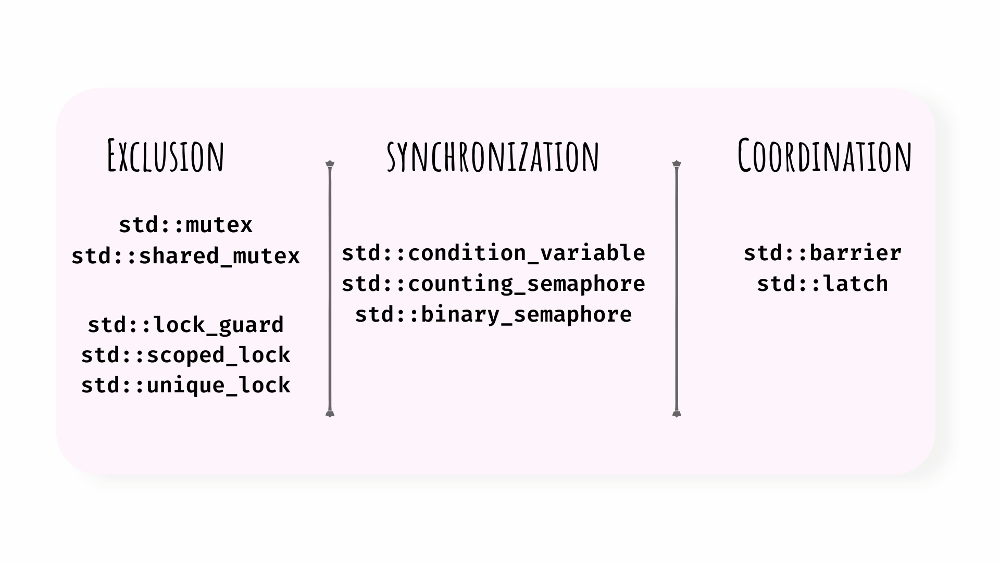

## Motivation:

There are some explanations on certain terminologies commonly seen whenever multithreading is brought up. These terminologies should be somewhat familiar to people who study computer science. However, even when I knew what they meant, I didn't know how they interoperate with other "CS thingies". For example, when one of my professor asked a question "If a computer just runs one thread at a time, is it necessary to ensure synchronization ?", it befuddled me. I wondered if the question made any sense and why were we asked such a question. I also failed to understand how mutexes, locks, semaphores,etc were differ from each other and what does each of them bring to the table. This may make some sense to other people but it just challenged my understanding of multithreading and concurrent programming. One method to solidify our thoughts is to write about it. Hence this article.
This article won't provide with implementation details on each primitive. It is to throw light on when and where each primitive is useful, and not examples on how to write them in code.
Understanding the above question opens up many aspects of concurrent programming.  Here we will approach the synchronization primitives made available to use in the STL (C++ 20 and above).
## std::mutex
available in header `<mutex>`
[cppreference](https://en.cppreference.com/w/cpp/thread/mutex)

*Used generally for Exclusion rather than Ordering.*

1. Allows a thread to modify a shared variable.
2. **Must be released by the same thread that locks it**. If not released, then there's no way to allow other threads depending on it to run. Ultimately, the process (mostly the application) has to exit to regain control.
3. Other threads who try to acquire the lock are blocked. What does it mean when a thread is said to be blocked ? The OS uses certain scheduling techniques(FCFS, round robin, MLFQS, etc) to schedule the time certain threads are run. When a thread X is said to be blocked, the thread doesn't start executing even when the OS schedules it run. This is the reason, that even when a single thread is run at a time, it is necessary to ensure synchronization. There's a possibility that when a thread is executing in its critical section, it is put to the back of the scheduling queue by the OS; and at the same time another thread can run its own critical section. There is no guarantee to make a thread run entirely on its own without being interrupted by the OS, but there are ways to increase the probability of this particular thread being run the most number of times [^1]. In any case, it is evident that even in a computer where a single thread is executed at a time, it is necessary to ensure synchronization. Remember, that issue of synchronization pops up when you are trying to make a program run by multiple threads and if these threads share some data between them.
4. Other threads can avoid being blocked by using `try_lock`. This tries to own a mutex, but is not blocked if mutex is already taken. This allows the attempting thread to do something else while waiting for the lock to release. This means that when a thread is allowed to work by the OS scheduler, it'll continue with some other work until the mutex is made available. This is useful, because when though a thread is blocked, the OS has alloted some time units for this thread to work in. This leads to the thread just waiting for the mutex to be free when it could do some other work. This effect is called "busy waiting".
5. Normally, mutexes are never used in their raw format, they are used along with a lock. C++ STL gives you multiple ways to use a mutex, through `std::lock_guard`, `std::unique_lock` and `std::scoped_lock`.
6. If the shared variables are simple primitive data items then C++ gives you the std::atomic. std::atomic can be used for cpp data types or even shared/weak pointers.

    [std::atomic cppreference](https://en.cppreference.com/w/cpp/atomic/atomic)

## std::shared_mutex
available in header `<mutex>`

 1. Allows multiple threads shared access if are only going to read from the shared data. Nothing much to it, it works similar to how mutexes are supposed to work except with more flexibility than just blocking any thread.
 2. Two types of locking mechanisms are provided : `lock()` and `lock_shared()` and their corresponding unlock() calls.
    1. `lock()` allows locking the access to just readers (i.e if you are reading only from the shared data store).
    2. `lock_shared()` allows locking the access to readers and writers (i.e if you are writing to the shared data store).
 3. Writers have exclusive access. When lock is acquired by writers, readers and other writers are blocked.
 4. **lock had to be released by the same thread that acquires it.**

 [std::shared_mutex cppreference](https://en.cppreference.com/w/cpp/thread/shared_mutex)

## std::scoped_lock/ std::lock_guard / std::unique_lock
available in header `<mutex>`

 1. All three provide a convenient way of owning a mutex through cpp’s RAII style. **lock is released when execution goes out of scope.**.
 2. This is not only to prevent developers' mistakes of forgetting to release the mutex but also to safeguard against exceptions.
 3. `std::unique_lock` enables a mutex to be moved to another structure like `std::condition_variable` (more on this later); `std::lock_guard` provides simple RAII convenience but can only use one mutex. If nesting multiple mutexes is what you need then `std::scoped_lock` can hold multiple nested mutexes.

    [std::scoped_lock cppreference](https://en.cppreference.com/w/cpp/thread/scoped_lock)

------

💡 Up until now, you only had to worry about *Exclusion*. i.e. two threads not changing the same shared variable.
But what if you want more control over the order of threads executed. Suppose you have an application where you wish to display some data that is to be fetched from some an online repo, you have a function that does this fetching.

Now you have heard about this new thing called multithreading and want to be very efficient with your time, so you assign another thread to fetch this data. You now have two threads, main and fetcher threads. you delegate the fetcher to fetch the data and allow your main to display the data. but how can the main display the data when the fetcher is made to sleep by the OS.
The main thread doesn't know what happened to the fetcher thread or how long it'll take to get the data. While the fetcher is sleeping, the main thread displays nothing and probably exits. This is a problem because you have to make the main thread wait until the fetcher thread does its job.

This means you want some kind of mechanism to handle the order of execution to be such that main displays only when fetcher is done its job. This leads to the process of "*Synchronizing*" the threads.
Following are some thingies made available by the C++ STL to make this power of synchronization available to programmers.

## std::condition_variable (aka cv)
available in header `<condition_variable>`

 1. has a queue that holds the waiting threads blocked due to some condition on the shared variable.
 2. Threads are blocked until another thread both modifies the shared condition and notifies the condition_variable.
 3. Requires a mutex to work. specifically `std::unique_lock<std::mutex>`. One condition variable should work only with single mutex. Whereas, multiple condition variables can share a single mutex. The cv queue is handled by the condition variable object, and has nothing to do with the mutex associated with the cv.
 4. To block a thread on some condition, use `cv.wait( lock, function )` . The *function* does the checking of a shared variable, and you require a *lock* to read this variable as it is shared between threads.
 5. The Thread that wants to change the shared variable must acquire a mutex, modify the shared variable if it wants and then release the mutex, and notify cv. After notifying cv, the cv checks if the condition predicate is true and unblocks a waiting thread if it is true.
 6. The example given in cpp reference doc is good and I'd recommend to give it a read an undestand what's happening.

    [std::condition_variable cppreference](https://en.cppreference.com/w/cpp/thread/condition_variable)

## std::counting_semaphore, std::binary_semaphore
(from C++ 20) available in header `<semaphore>`

 1. Think of a semaphore as a charging brick with multiple ports. The number of ports is analogous to the count in a counting semaphore. You can only attach a fixed number of devices to the ports. Other devices that wish to connect to these ports must wait for ports to open up.
 2. A counting semaphore has a mutex, a condition variable, and count c. In std::counting_semaphore one needs only to mention count c for constructing a c_semaphore.
 3. A binary semaphore is when the counting c is 1. Which allows only one thread to use the shared resource. This differs from a mutex in the sense of ownership. Mutex has to be released by the calling thread as it is owned by the calling thread. A binary_semapahore can be released by other threads even if they are not the owner of that lock.
 4. This is similar to a cv in the sense that threads wait on the condition of c becoming > 0.
 5. Used mainly for signalling/notifying rather than mutual exclusion. How ? By blocking other semaphores that are required by the other threads. A little rude maybe but it works. Semaphores are useful for having that particular order in execution of threads. Allowing access to a resource is done by a mutex/lock, making it efficient to determine (who among those allowed) gets the resource is done by a condition variable, and having a certain order in accessing this resource is done by a semaphore.

    [std::counting_semaphore, std::binary_semaphore cppreference](https://en.cppreference.com/w/cpp/thread/counting_semaphore)

## std::barriers
(from C++ 20) available in header `<barrier>`

 1. Used mainly for thread coordination. A barrier is a door which waits for a certain number of threads to come to it. Threads do not wait on some condition to become true. They simply wait till the barrier receives enough number of threads requesting for this particular resource.
 2. Considers number of threads to wait for the barrier to release. Barrier is released when c number of threads are blocked on the `wait()` condition.
 3. Can be reused unlike `std::latch`

    [std::barriers cppreference](https://en.cppreference.com/w/cpp/thread/barrier)

## std::latch
(from C++ 20) available in header `<latch>`

 1. Used mainly for thread coordination. This is similar to `std::barrier` in sense that threads are made to wait on an external variable that is not used in their critical section. They wait until a latch is opened.
 2. A latch doesn’t require a thread to block itself to signal release of the barrier. Barrier is released when the a thread calls the `count_down()` function. Calling the `count_down()` function doesn’t block this thread.
 3. Calling thread can decrement latch multiple times.

    [std::latch cppreference](https://en.cppreference.com/w/cpp/thread/latch)

## std::future (similar to Promise in js)
This is similar to how Promise works in js. If a function is run asynchronously, it's return value is stored as a std::future object. waiting on this future  object blocks the thread until the value is made available. Otherwise, the thread is free to continue working its own logic.

[std::future cppreference](https://en.cppreference.com/w/cpp/thread/future)

[^1]: One ways that I know how this could be done is by assigning priority to a thread. However, even this doesn't guarantee that a thread will not be interrupted. This is because kernel threads may have a higher priority than threads of user programs and this cannot be controlled without kernel privileges.