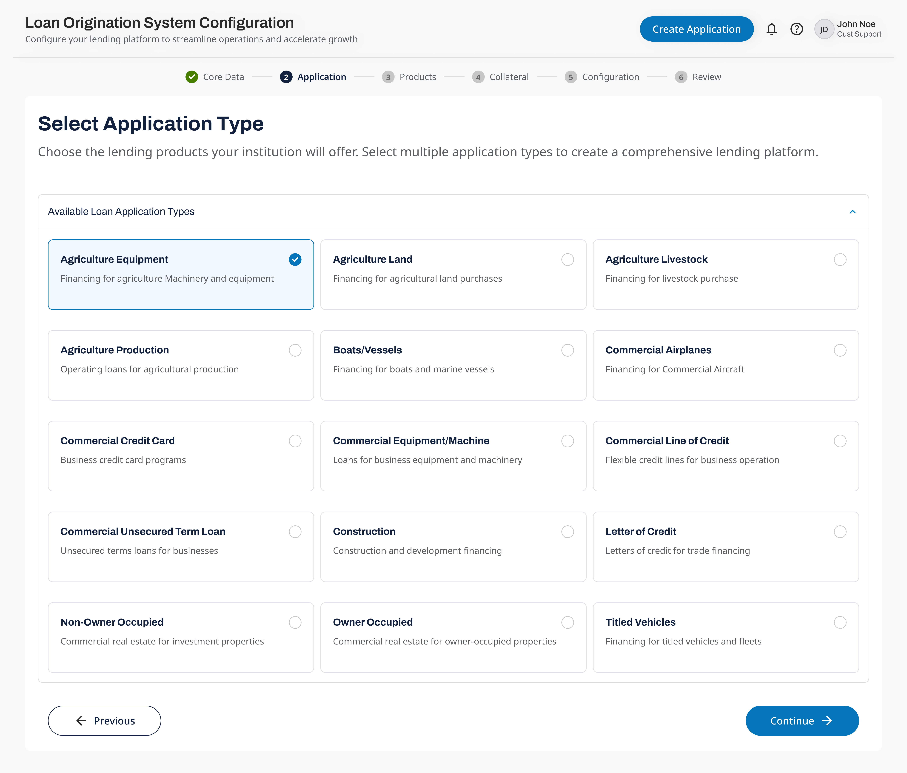

# Heading 1

## Heading 2

### Heading 3

some random text formatted **bold,** _italic,_ <u>underlined</u>

```python
def some_python_code():
	pass
```

---

Some image now



---

some url next

[https://www.google.com](https://www.google.com/)

---

A GIF here


