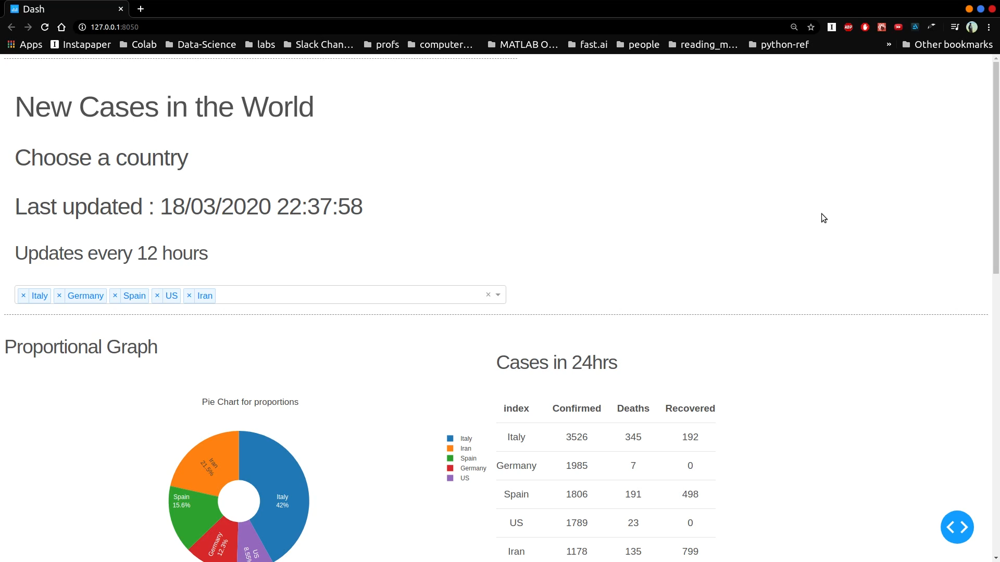
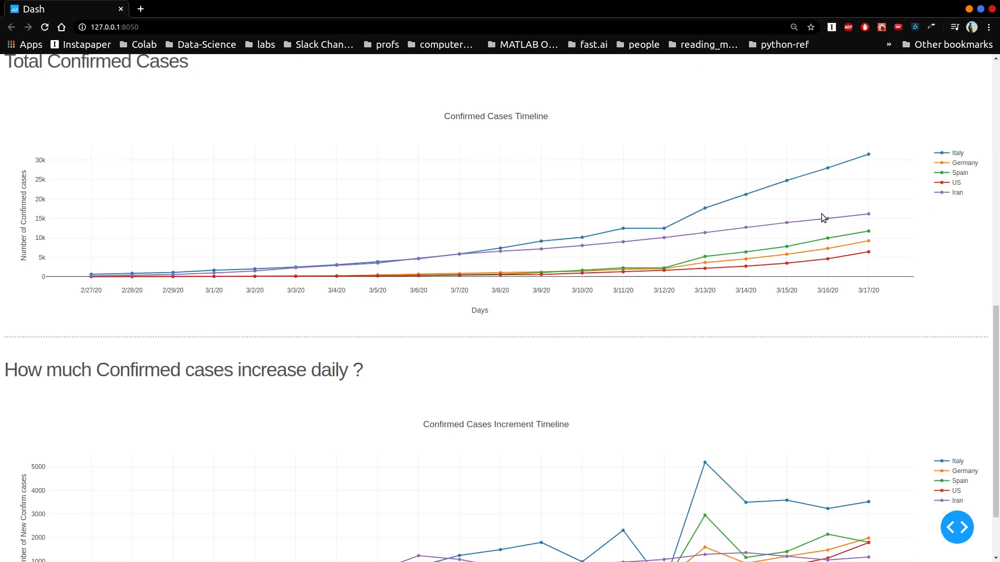
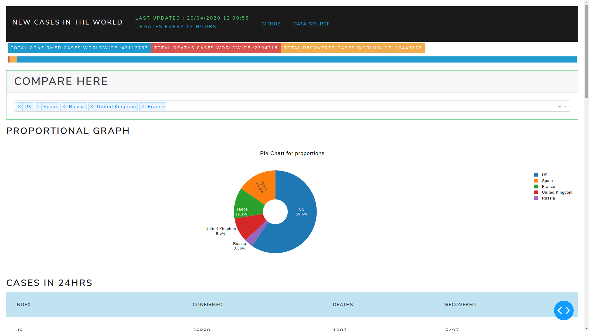
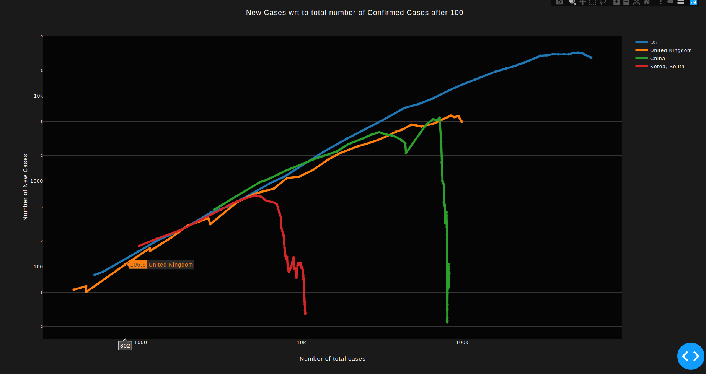
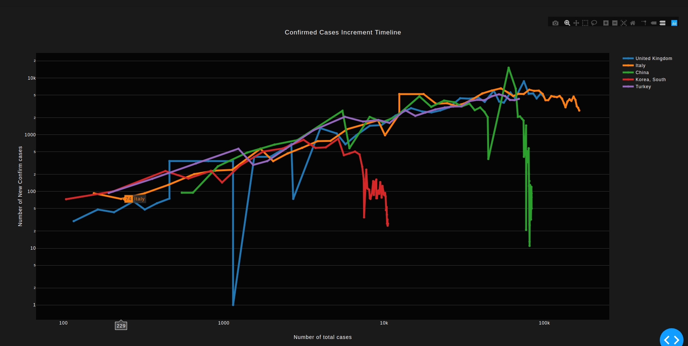

It was around January 2019 when I heard of the rising cases of a deadly disease spreading in china. I was deep into studying data science and machine learning that time and lived and breathed on the Kaggle website. I found the dataset on the number of cases of COVID; people were already making kaggle notebooks on this data. I knew I had to jump on this train. Thus, I started a kaggle notebook with this dataset colected and made available by John Hopkins University.
I quickly prototyped a working chart and started making all types of diagrams I could make from this data. "This is going to be a big deal" I thought. I was surprised, confused and delusionally delighted that such an infectious virus hadn't made its way in India yet, especially considering that the country where it started was its neighbour. In fact, the US had reported early cases of COVID than India(though now I realise that it must have been started in India too but was not reported due to lack of intensive tesing done at that time). India had already set up travel restrictions to and fro China, so that might have delayed the spread.

Anyway, I have digressed enough. I started making plans of converting this analytical notebook into a web app that could be statically hosted somewhere where it would automate the process of fetching data from JHU, processing the data and presenting it in a easy to understand dashboard. This is the start of that project which is now hosted on Heroku on [this link](https://covid-19-visual.herokuapp.com/).

The dashboard shows 5 diagrams.
1. Pie chart of the top 5 countries with highest total number of cases.
2. Table showing the case data for the above top 5 countries.
3. A graph of total confirmed covid cases against time.
4. A graph of total deaths due to covid against time.
5. A graph of new cases per total number of cases. _This was very amazing to see  as it actually showed what country is seeing a rise in spread of coronavirus._

I used python for fetching and processing the data. Visualizing of data was done by the plotly library. The webapp is hosted on a heroku server.

### Version 1.0   Date: March 12-18, 2020

- Implemented a Confirmed Cases count graph.
- Implemented a New cases per day graph.
- Implemented a Pie chart for comparing proportions.
- Implemented a Table to give info on daily new cases.
- Deployed in production mode to Heroku.

[^1]: [How To Tell If We're Beating COVID-19 - minutephysics](https://youtu.be/54XLXg4fYsc?t=169)

---
### Version 1.5   Date: March 23-27, 2020

__Updates__

- Added a Death Count Graph.
- Changed the theme of the dashboard to look more presentable.
- Added functionality of updating data in every refresh or at intervals of 6 hours.

---

### Version 2.0   Date: April 15, 2020

__Final__

- The numbers had very extreme values due to inconsistency of data. Since we are focusing only on the trend, we do not require exact numbers. Therefore, a rolling mean of 5 values is implemented to smoothen out the irregularities.

__Initial__

- Added a graph plotting new cases to existing cases.
- The Graph is number of New cases per Total number of cases. In order to understand exponential growths for diseases, we must not plot the growth against time (which is not so useful in prediction) ; but with the total existing numbers.[^1]
- A fall in the graph indicates lowering of new cases with total cases. i.e. We see that China and Korea are out of the danger of new cases. Italy and Spain are seeing small rates of controling the virus.
- Axes are plotted on logarithmic scale.
